### Stack

**Sólido**
`Java 21` `Spring Boot` `JPA/Hibernate` `PostgreSQL` `MySQL` `SQL` `APIs REST` `JUnit 5` `Mockito` `MockMvc` `Git` `Maven` `Linux`

**Já apliquei em projeto**
`Spring Security` `JWT` `Flyway` `Testcontainers` `Docker` `Docker Compose` `Spring Cloud` `MapStruct` `Caffeine` `Bucket4j` `Swagger/OpenAPI` `IndexedDB` `Flask` `SQLAlchemy`

**Estudando**
`LLM via API e tool-calling` `modelos locais em GPU` `STT/TTS`

### Destaques

- **[rolo35](https://github.com/0Perera/rolo35)** — plataforma de venda de ingressos com mapa de assentos, construída em 7 dias trabalhando em período integral. Cada decisão está registrada no repositório.
- **[sistema-etiquetas](https://github.com/0Perera/sistema-etiquetas)** — identifiquei o gargalo na expedição do almoxarifado e construí o sistema por conta própria, sem ninguém pedir. As máquinas não permitiam instalação e a rede bloqueava CDN, então virou um arquivo HTML único: era a única forma de algo rodar ali. Está em uso em todos os almoxarifados da usina.
- **Auditoria 5S** `sem repositório público` — depois do sistema de etiquetas, o time responsável pelas auditorias me procurou. O processo deles consumia vários dias: ficha preenchida em papel, digitalizada no scanner, fotos montadas à mão num documento do Word, tudo impresso e digitalizado de novo para virar um arquivo só. Propus substituir a cadeia inteira por um formulário único que já entrega o PDF padronizado no fim.

### Onde eu ando mexendo

- Controle de concorrência em Postgres e testes de integração com Testcontainers, que é o assunto que mais me consumiu tempo nos últimos meses.
- Um agente local que opera a máquina junto comigo, com modelo rodando na minha própria GPU, whitelist de comandos e log de auditoria de tudo que ele faz. A parte que mais me interessa é a memória: como decidir o que vale guardar de uma sessão e o que descartar, sem o custo de consolidação crescer sem controle. Ainda em projeto.
- O sistema de auditoria de 5S, em avaliação pela TI. Roda no navegador do celular, offline, com foto como evidência e PDF padronizado no fim. Cheguei a avaliar um app, mas o único ganho seria publicar atualização, e eu não teria esse acesso: um arquivo que se manda por e-mail para qualquer aparelho entrega o mesmo por muito menos.

[LinkedIn](https://linkedin.com/in/felipe-pereira0201) · feeps_@hotmail.com
